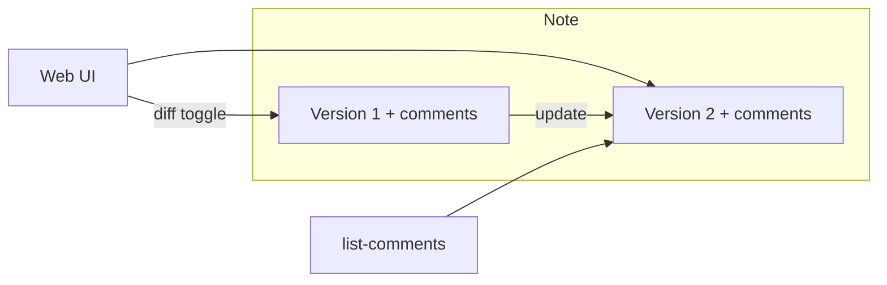

# comment-md — specification

Stripped-down fork of [jot](README.md): markdown notes with inline comments, reduced to **CLI + web UI**, **no MCP**, **no auth**, **no CRDT**, **SQLite + Prisma**, **per-version comments**, **Bun + React + tRPC**.

---

## Goals

| Keep | Drop |
|------|------|
| Markdown notes with rendered preview | MCP server |
| Inline comment threads on text | Owner/share auth, API keys, login UI |
| CLI for agents/automation | Multi-instance CLI config (`~/.config/jot`) |
| Web UI for human review/comment | Note editing in web UI |
| | CRDT / WebSocket collab (`articulated`, `collab-*`) |
| | File-based storage (`data/notes/*.json`) |
| | Share links, access levels, identity modal |
| | Nested reply trees (beyond “reply to last message”) |
| | Most CLI commands (`search`, `edit` patches, `delete`, etc.) |

---

## Non-goals (v1)

- Multi-tenant or per-user accounts
- Real-time co-editing
- Import/migration from legacy jot file layout
- Mobile-optimized layout (responsive is fine, not a focus)
- Full-text search across notes

---

## Runtime & stack

| Layer | Choice |
|-------|--------|
| Runtime | [Bun](https://bun.sh) |
| Server | Bun HTTP + [tRPC](https://trpc.io) |
| DB | SQLite via [Prisma](https://www.prisma.io) |
| Web | React (Vite), tRPC client, TanStack Query |
| CLI | Bun-compiled **single executable**; tRPC client |
| Markdown | `marked` + `sanitize-html` (or equivalent); server renders HTML |
| Diff (web) | Inline red/green markup over rendered content (see [Diff toggle](#diff-toggle)) |

**Monorepo layout (suggested):**

```
apps/
  server/     # tRPC + Prisma + markdown render
  web/        # React SPA
  cli/        # comment-md binary
packages/
  api/        # tRPC router types + Zod inputs (shared)
prisma/
  schema.prisma
spec.md
```

---

## Security model

**No application auth.** Intended for localhost or a trusted network.

- Server binds to `HOST` (default `127.0.0.1`) and `PORT` (default `3210`).
- No cookies, API keys, or login flows.
- **Assumption:** anyone who can reach the URL can read notes and read/write comments.

---

## Configuration

### Server

| Env var | Default | Description |
|---------|---------|-------------|
| `HOST` | `127.0.0.1` | Bind address |
| `PORT` | `3210` | HTTP port |
| `DATABASE_URL` | `file:./data/comment-md.db` | SQLite path for Prisma |
| `COMMENT_MD_SHARE_BASE_URL` | _(unset)_ | Optional base URL used in the `shareUrl` field returned by `note.create` / `note.update`. When unset the server falls back to `X-Forwarded-Proto` + `X-Forwarded-Host` headers (if present, set by a reverse proxy) and finally to the inbound request's own scheme + Host header. Trailing slashes are stripped. |

### CLI

| Env var | Required | Description |
|---------|----------|-------------|
| `COMMENT_MD_SERVER_URL` | yes | Base URL, e.g. `http://127.0.0.1:3210` (no trailing slash) |
| `COMMENT_MD_SHARE_BASE_URL` | no | Optional **client-side override** for the share URL. When set, the CLI replaces the `shareUrl` returned by the server with `<override>/notes/<noteId>`. The canonical place to configure the share base is the **server** (see [Configuration § Server](#server)); this CLI-side knob exists only for local testing against a server that doesn't know its public hostname. |

- **One server only** — no register/alias config files.
- Binary name: **`comment-md`**.

---

## Domain model

### Note

- Identified by `noteId` (opaque string, e.g. cuid).
- Has many **versions**; the **latest** is derived per-query as the version with the greatest `createdAt` (no stored pointer — see [Database](#database-prisma-sketch)).
- **`title`:** basename of the file path without extension (e.g. `docs/Plan Q2.md` → `Plan Q2`).
  - Set on **`create`** from the source file path.
  - **Updated on every `update`** from the new source file path (not only on first create).
  - If basename-without-extension is empty (e.g. file named `.md`), title is the empty string. The web UI falls back to `noteId` in the page header.

### Version

- `versionId`, `noteId`, `markdown` (full snapshot), `createdAt`.
- Immutable once written.
- New version on every successful **`create`** (initial) and **`update`** CLI call.
- **Empty markdown is allowed** (e.g. `create` on an empty file → note with one empty version).

### Comment thread

- Belongs to **`versionId`** (not merely `noteId`).
- `threadId` globally unique (lookup infers `noteId`).
- Fields: `anchor` (quote + prefix + suffix + start + end — same fuzzy model as upstream preview), `resolved`, `createdAt`, `updatedAt`.
- **v1:** one root message per thread; further messages are flat replies (no nested trees).
- **Threads are always initiated by a User from the web UI** (via `comment.createThread`). Agents have no CLI command to create threads; they can only `reply` to or `resolve` existing ones. This guarantees every anchor was derived from a real text selection in the rendered preview.

### Comment message

- Belongs to a thread.
- `authorLabel`: `"Agent"` or `"User"`, supplied by the caller in the `comment.reply` request body. CLI sends `"Agent"`; web UI sends `"User"`. Server does not enforce which value comes from which client (there is no auth). `comment.createThread` always writes `"User"` regardless of caller (see [Comment thread](#comment-thread)).
- `body`, timestamps.

### Versioning rules

1. **CLI always targets the latest version** of a note (for `update`, `list-comments`, and any note-scoped logic).
2. **`update <noteId> <file>`** always creates a new version, even if the markdown is byte-identical to the previous version. Comments on the previous version remain attached to that version's row in the DB and are filtered out by `list-comments` and the web UI, which only query the latest version's threads. **This means open threads silently drop out of view on every `update`**, including no-op updates — agents and users should treat `update` as a destructive operation for the comment surface.
3. **`list-comments <noteId>`** returns **open** threads on the latest version only (see [CLI](#cli-specification)). After an `update`, result is **empty** until new comments exist on the new version.
4. **Web UI** by default loads latest version markdown + latest version comments only. The [Diff toggle](#diff-toggle) is the read-only exception.
5. **Web UI diff toggle:** **inline** diff of **latest** vs **previous** version (see [Diff toggle](#diff-toggle)).



---

## API (tRPC)

All procedures are **public** (no auth middleware). Shared input validation with Zod in `packages/api`.

### `note`

| Procedure | Used by | Description |
|-----------|---------|-------------|
| `create` | CLI | `{ markdown, title }`. Returns `{ noteId }` only. |
| `update` | CLI | `{ noteId, markdown, title }`. New version. Returns `void`. |
| `get` | Web | `{ noteId }`. Returns `{ noteId, title, versionId, markdown, html, threads }` — latest version's markdown, server-rendered HTML, and all threads (open + resolved) on that version. |
| `getDiff` | Web | `{ noteId }`. Returns `{ previousMarkdown: string \| null, latestMarkdown: string }`. The client computes and renders the inline diff (server does not pre-render). `previousMarkdown` is `null` when the note has only one version. |
| `list` | — | **Out of scope for v1 CLI.** Optional later. |

### `comment`

| Procedure | Used by | Description |
|-----------|---------|-------------|
| `list` | CLI | `{ noteId, includeResolved?: boolean }`. Default `false`. Latest version only. |
| `createThread` | Web | `{ noteId, anchor: { quote: string, prefix: string, suffix: string, start: number, end: number }, body: string }`. Author is always written as `"User"` (see [Comment thread](#comment-thread)). |
| `reply` | CLI, Web | `{ threadId, body: string, author: "Agent" \| "User" }`. Appends after the last message in the thread by `createdAt`. |
| `resolve` | CLI, Web | `{ threadId }`. Sets `resolved: true`. |

**All write procedures** (`comment.createThread`, `comment.reply`, `comment.resolve`) verify the targeted note/thread is on the note's latest version (computed at request time) and return an error otherwise (e.g. `note has been updated` or `thread not on latest version`). This protects against stale web tabs and out-of-band CLI updates.

**Not in v1:** `reopen`, `editComment`, `deleteComment`, `deleteThread`, share endpoints.

### CLI → server mapping

| CLI command | tRPC |
|-------------|------|
| `create <path>` | Read file → derive `title` from basename → `note.create` |
| `update <noteId> <path>` | Read file → derive `title` → `note.update` |
| `list-comments <noteId> [--include-resolved]` | `comment.list` |
| `reply <threadId> "…"` | `comment.reply` |
| `resolve <threadId>` | `comment.resolve` |

---

## CLI specification

### Invocation

```bash
comment-md create <path/to/file.md>                    # stdout: two lines — noteId then share URL
comment-md update <noteId> <path/to/file.md>           # stdout: two lines — noteId then share URL
comment-md list-comments <noteId> [--include-resolved] # open threads only by default
comment-md reply <threadId> "<content>"                # exit 0; author Agent
comment-md resolve <threadId>                          # exit 0
```

- Paths are local filesystem paths on the machine running the CLI.
- `create` / `update` read the full file as UTF-8 markdown (may be **empty**).
- `update` replaces the entire note body (no partial edits).
- Errors: non-zero exit, message on stderr.

#### `create` / `update` stdout

Both commands write **exactly two lines** on success:

```
<noteId>
<shareUrl>
```

- `<noteId>` is the note's opaque id.
- `<shareUrl>` comes from the server: `note.create` / `note.update` return `{ noteId, shareUrl }` and the CLI prints what's returned. The server builds the URL from `COMMENT_MD_SHARE_BASE_URL` if set, otherwise from `X-Forwarded-*` headers (when behind a proxy) or the inbound `Host` header.
- If the CLI process **also** has `COMMENT_MD_SHARE_BASE_URL` set, that value wins — the CLI rebuilds the line as `<override>/notes/<noteId>`. This is the local-testing override.
- This is a deliberate, parsed-by-line format: scripts read the id with `head -1` and the URL with `tail -1`. No JSON, no `versionId`.

### Title derivation

```ts
// basename without extension; "report.final.md" → "report.final"
title = path.basename(filePath, path.extname(filePath))
```

Applied on both `create` and `update`.

### `list-comments`

- **Default:** open (unresolved) threads on the latest version.
- **`--include-resolved`:** also print resolved threads on the latest version.
- Does not return threads from older versions.

**Output format:**

Each thread is a header line followed by one indented line per message:

```
thread <threadId> [resolved] anchor=<json-quoted quote>
  <messageId> <Agent|User> <iso-8601 createdAt> <json-quoted body>
```

- The literal token `[resolved]` appears only when the thread is resolved (i.e. only when surfaced via `--include-resolved`); for open threads, the brackets and word are omitted entirely.
- `<json-quoted quote>` and `<json-quoted body>` are JSON-string-encoded (double-quoted, with `\n`, `\"`, `\\`, etc. escaped per RFC 8259). This ensures the format survives quotes, newlines, and other special characters in user content.
- `<iso-8601 createdAt>` is UTC, second-precision: `YYYY-MM-DDTHH:MM:SSZ`.
- Threads are separated by a single blank line. No trailing blank line after the last thread.

### `reply` semantics

- Resolve `noteId` from `threadId` via DB.
- Verify thread belongs to note’s **latest** `versionId`; otherwise error (e.g. “thread not on latest version”).
- Append after the **last message** by `createdAt` (root if none).

---

## Web UI specification

### Routing

- `GET /notes/:noteId` — main (and only required) view.
- Page title / header shows note **`title`**.

### Layout

- **Rendered markdown only** (no textarea, no collab editor).
- Comment UI: select text in preview → new thread (anchor model from upstream `buildAnchorFromSelection` / `locateAnchor`, in React).
- Thread rail + highlights on preview.
- Actions: **comment** (new thread), **reply** (last message in thread), **resolve**.
- **Author label:** always `User` for web writes.

### Threads display

- **Open threads:** visible in rail and as preview highlights (default).
- **Resolved threads:** **collapsed** section (e.g. “Resolved (N)” accordion); not shown inline on the preview unless expanded for read-only viewing.

### Diff toggle

- Control in header: e.g. “Show changes since last version”.
- **Format: inline** — render previous vs latest with **deletions in red** and **additions in green** in the document flow (not side-by-side panes, not unified diff text).
- If there is no previous version (first version only), toggle disabled or shows “No previous version”.
- Comments and highlights apply to **latest** content only; diff mode is read-only for commenting.

### Data loading

- tRPC + React Query: `note.get`, `note.getDiff`.
- Poll `note.get` (e.g. 2–5s) for **everything**: new comments on the current version *and* new versions created via the CLI. If the returned `versionId` differs from the one currently in view, the UI reloads markdown, HTML, and threads from the response. No WebSocket in v1.

### Static hosting

- SPA served by same Bun server in production; Vite dev proxy in development.

---

## Database (Prisma sketch)

```prisma
model Note {
  id        String   @id @default(cuid())
  title     String
  createdAt DateTime @default(now())
  updatedAt DateTime @updatedAt
  versions  Version[]
}

model Version {
  id        String   @id @default(cuid())
  noteId    String
  note      Note     @relation(fields: [noteId], references: [id], onDelete: Cascade)
  markdown  String   @default("")
  createdAt DateTime @default(now())
  threads   Thread[]
  @@index([noteId, createdAt])
}

model Thread {
  id         String   @id @default(cuid())
  versionId  String
  version    Version  @relation(fields: [versionId], references: [id], onDelete: Cascade)
  resolved   Boolean  @default(false)
  quote      String
  prefix     String   @default("")
  suffix     String   @default("")
  start      Int
  end        Int
  createdAt  DateTime @default(now())
  updatedAt  DateTime @updatedAt
  messages   Message[]
  @@index([versionId, resolved])
}

model Message {
  id        String   @id @default(cuid())
  threadId  String
  thread    Thread   @relation(fields: [threadId], references: [id], onDelete: Cascade)
  author    String   // "Agent" | "User"
  body      String
  createdAt DateTime @default(now())
  @@index([threadId, createdAt])
}
```

**Latest version is derived, not stored.** Every read that needs "latest" runs a `Version` query scoped to the `noteId`, ordered by `createdAt DESC`, limit 1. The `(noteId, createdAt)` index above is what keeps this cheap. This avoids the nullable-pointer / two-phase-create problem of a `latestVersionId` column on `Note`.

---

## Comment anchoring (web)

1. Flatten rendered preview DOM to `fullText`.
2. Selection → `{ quote, prefix, suffix, start, end }` in preview coordinates.
3. Store on thread; relocate highlights via quote + prefix/suffix + start hint on re-render.

**Caveat:** anchors are preview-text-based, not markdown byte offsets. CLI `list-comments` exposes `quote` for Agent context.

---

## Deployment

Two shipped artifacts: one Docker container for the server, one static binary for the CLI.

### Server — single Docker container

- The entire server (tRPC API + server-rendered markdown + built React SPA served as static assets) runs in **one container, one process**. No sidecars, no separate web server, no Prisma migration container.
- Multi-stage Dockerfile: build stage compiles the SPA (Vite) and the server (Bun); runtime stage is a minimal Bun base image with only the compiled output and `prisma` for migrations.
- Container entrypoint runs `prisma migrate deploy` then starts the Bun server.
- Exposes a single port: `PORT` (default `3210`). No MCP port. No WebSocket port.
- SQLite is the only datastore. The DB file lives on a mounted volume; configure via `DATABASE_URL` (e.g. `file:/data/comment-md.db` with `/data` mounted).
- Environment: `HOST`, `PORT`, `DATABASE_URL` (see [Configuration](#configuration)).

### CLI — single static binary

- `bun build --compile` produces a self-contained `comment-md` executable. No Bun runtime, no `node_modules`, no Prisma at runtime (the CLI is a tRPC HTTP client and never touches SQLite directly).
- Distribute by dropping the binary on `$PATH`. The only required configuration is the `COMMENT_MD_SERVER_URL` env var.
- CI builds per OS/arch and publishes the binaries; no installer, no wrapper script.

### Development

- `bun run` starts the server and the Vite dev server for the web SPA, with Vite proxying tRPC calls to the Bun server.
- Local DB defaults to `file:./data/comment-md.db`.

---

## Implementation phases

### Phase 1 — Foundation
- Bun monorepo, Prisma schema, migrations
- `note.create` / `note.update` / `note.get` (title from filename, empty body allowed)
- Markdown render on server
- CLI: `create`, `update` with `COMMENT_MD_SERVER_URL`

### Phase 2 — Comments
- `comment.list` (with `includeResolved`), `comment.createThread`, `comment.reply`, `comment.resolve`
- CLI commands wired
- Latest-version enforcement on `comment.createThread`, `comment.reply`, and `comment.resolve` (reject writes targeting a non-latest version); `comment.list` filters threads by the note's latest version computed at request time.

### Phase 3 — Web UI
- React: preview, selection, open threads, **collapsed resolved**, reply, resolve
- Inline diff toggle (`note.getDiff`)
- Polling for Agent updates

### Phase 4 — Polish
- `bun build --compile` → `comment-md` binary
- README, Docker, error handling

---

## Success criteria

- `comment-md create ./empty.md` prints a `noteId`; web shows an empty note.
- `comment-md create ./doc.md` sets title from filename; `comment-md update <id> ./renamed.md` updates title and body.
- User opens `/notes/:noteId`, comments as **User**; agent uses `list-comments`, `reply`, `resolve` as **Agent**.
- Resolved threads appear **collapsed** on web; omitted from CLI unless `--include-resolved`.
- `comment-md update` bumps version; `list-comments` is empty; web shows new content; **inline** diff vs previous version works.
- No auth, MCP, WebSocket, or file-based note storage.
